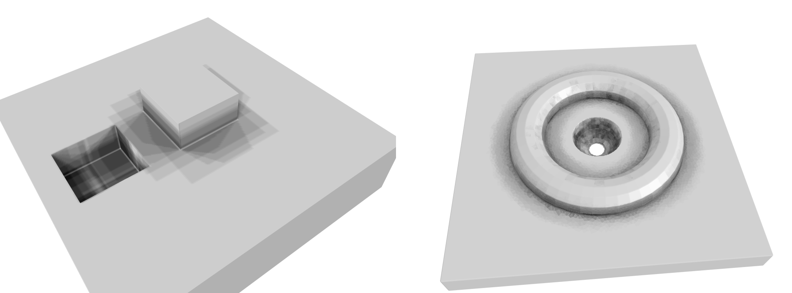

# Trimesh Ambient Occlusion

Attempts to implement ambient occlusion in trimesh.

### ao.py

First attempt: Use precomputed normal directions by sampling a sphere.
Index into those using a KDTree, to find all hemisphere directions for
a given normal. Raytrace from all vertices to all hemisphere directions,
count up and convert to color. Store as vertex colors.

